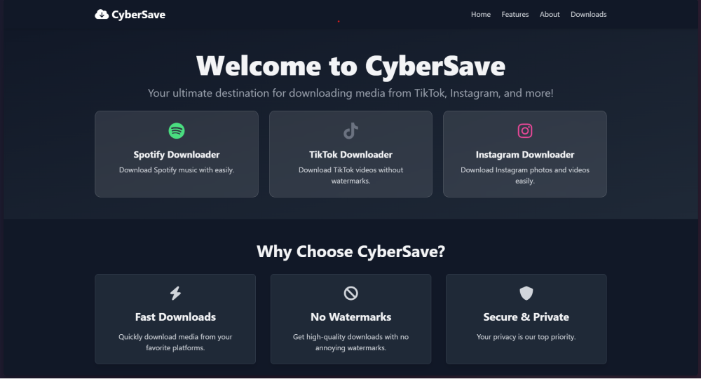

# **CyberSave - Ultimate Media Downloader**


**CyberSave** adalah sebuah aplikasi berbasis web modern dengan desain futuristik yang memungkinkan pengguna untuk mengunduh media dari berbagai platform, seperti TikTok, Instagram, dan banyak lagi, dengan mudah, cepat, dan tanpa watermark. Aplikasi ini dirancang dengan teknologi terkini dan UI/UX yang responsif untuk pengalaman pengguna terbaik, baik di perangkat mobile maupun desktop.

## **Fitur Utama**
- 🚀 **Cepat dan Mudah**: Unduh media favorit Anda hanya dengan beberapa klik.
- 🎥 **Tanpa Watermark**: Video diunduh dalam kualitas tinggi tanpa watermark.
- 🎵 **Unduh Audio**: Ekstrak audio dari media yang Anda pilih.
- 🌌 **Desain Futuristik**: UI modern dengan tema dark material dan efek animasi.
- 🔄 **Fallback API**: Sistem otomatis mencoba beberapa API jika salah satu gagal.

## **Tampilan**
### Desktop


### Mobile


## **Teknologi yang Digunakan**
- 💻 **Frontend**: HTML5, Tailwind CSS, JavaScript
- 🎨 **UI Library**: Font Awesome untuk ikon
- 🌐 **API**: Multi-Platform Downloader API dengan fallback otomatis

## **Instalasi**
1. Clone repositori ini:
   ```bash
   git clone https://github.com/your-repo/CyberSave.git
2. Buka folder aplikasi:
   ```bash
   cd CyberSave
3. Instal dependensi:
   ```bash
   npm install
4. Jalankan aplikasi:
   ```bash
   npm start
5. Buka aplikasi di browser:
   ```bash
   http://localhost:3000

## **Cara Menggunakan**
1. Pilih platform yang ingin Anda unduh.
2. Masukkan URL media yang ingin Anda unduh.
3. Klik tombol "Unduh" untuk memulai unduhan.

## **Roadmap**

- ✅ TikTok Downloader
- ✅ Spotify Downloader
- 🚧 Instagram Downloader


## **Kontribusi**

Kami selalu terbuka untuk kontribusi dari komunitas. Silakan fork proyek ini dan kirimkan pull request untuk perbaikan atau fitur baru.

1. Fork repositori ini.
2. Buat branch baru untuk fitur Anda:
   ```bash
   git checkout -b fitur-baru
3. Commit perubahan Anda:
   ```bash
   git commit -m "Tambahkan fitur baru"
4. Push perubahan Anda:
   ```bash
   git push origin fitur-baru
5. Buat Pull Request di GitHub.


## **Kontak**

Dibuat dengan ❤️ oleh **KOU**.

- **Instagram**: [@kou.sozo](https://www.instagram.com/kou.sozo)
- **LinkedIn**: [KOU](https://www.linkedin.com/in/alghani)
- **GitHub**: [KOU](https://github.com/fk0u)

## **Lisensi**

Proyek ini dilisensikan di bawah [MIT License](LICENSE).
